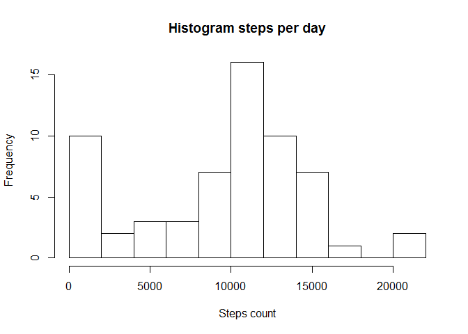
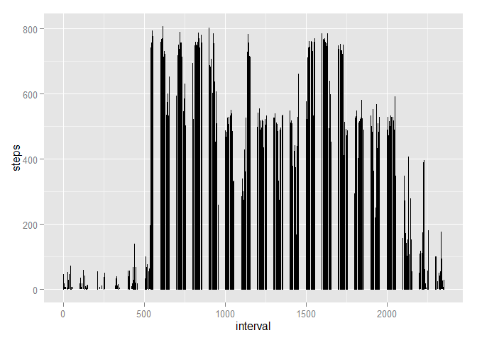
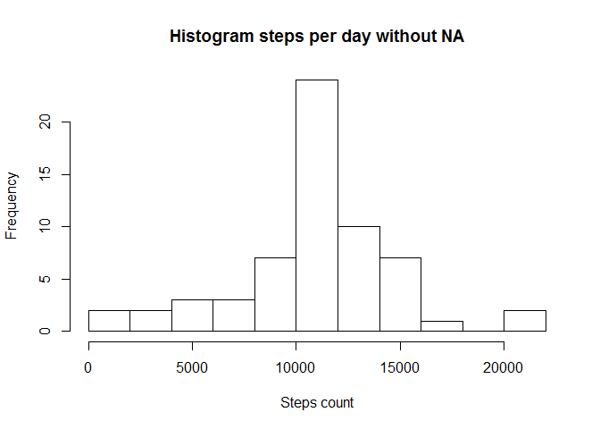
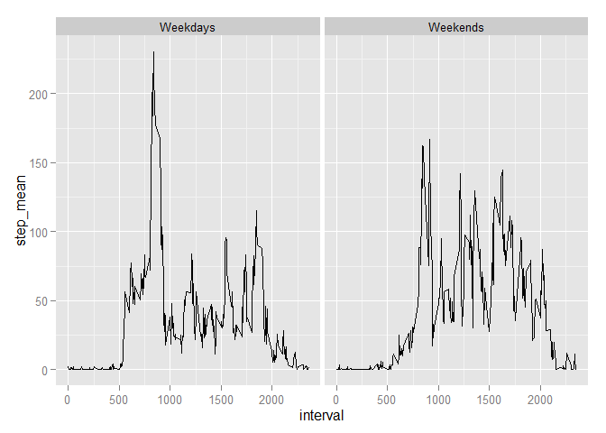

# PA1_template
Aleksandr Kliushev  
14.06.2015  
This research  about personal movement using activity monitoring devices such as a Fitbit, Nike Fuelband, or Jawbone Up.

Load library

```r
library(dplyr)
```

```
## Warning: package 'dplyr' was built under R version 3.2.2
```

```
## 
## Attaching package: 'dplyr'
## 
## Следующие объекты скрыты от 'package:stats':
## 
##     filter, lag
## 
## Следующие объекты скрыты от 'package:base':
## 
##     intersect, setdiff, setequal, union
```

```r
library(ggplot2)
```

1. The first step of research is a load, read and transform (to "tbl" format) data

```r
setwd("C:\\Users\\123\\Documents\\R\\coursera\\Reproduce Research\\PA1")
act_data<-tbl_df(read.csv("activity.csv"))
```
Let's see data

```r
act_data
```

```
## Source: local data frame [17,568 x 3]
## 
##    steps       date interval
##    (int)     (fctr)    (int)
## 1     NA 2012-10-01        0
## 2     NA 2012-10-01        5
## 3     NA 2012-10-01       10
## 4     NA 2012-10-01       15
## 5     NA 2012-10-01       20
## 6     NA 2012-10-01       25
## 7     NA 2012-10-01       30
## 8     NA 2012-10-01       35
## 9     NA 2012-10-01       40
## 10    NA 2012-10-01       45
## ..   ...        ...      ...
```
Group data for days

```r
act_day<-act_data%>%
      group_by(date)%>%
      summarise(step_sum=sum(steps,na.rm = T))
act_day$date<-as.POSIXct(act_day$date)
act_day
```

```
## Source: local data frame [61 x 2]
## 
##          date step_sum
##        (time)    (int)
## 1  2012-10-01        0
## 2  2012-10-02      126
## 3  2012-10-03    11352
## 4  2012-10-04    12116
## 5  2012-10-05    13294
## 6  2012-10-06    15420
## 7  2012-10-07    11015
## 8  2012-10-08        0
## 9  2012-10-09    12811
## 10 2012-10-10     9900
## ..        ...      ...
```

2. Mean and median number of steps
2.a Plot a histogram number of steps

```r
hist(act_day$step_sum,breaks = 15,
      main = "Histogram steps per day",xlab = "Steps count")  
```

 

2.b Count mean and median 

```r
step_mean<-mean(act_day$step_sum)
stem_med<-median(act_day$step_sum)
```
The mean of step in day is 9354.23 and  
median is 10395

3. Plot daily activity

```r
g<-ggplot(data = act_data,aes(interval,steps))
g+geom_line()
```

```
## Warning: Removed 2 rows containing missing values (geom_path).
```

 
How we can see the 600 - 2000 interval is contains the maximum number of steps.

4.Imputing missing values
4.a Count the missing values

```r
mis_v<-count(act_data[is.na(act_data$steps),1])[[1]]
```
Count the missing values is 2304

4.b Create new df, where missing value equal mean of 5 second interval

```r
act_int<-act_data%>%
      group_by(interval)%>%
      summarise(step_mean=mean(steps,na.rm = T))
act_data_no_m<-(left_join(x=act_data,y = act_int,by =c("interval"="interval"))%>%
      mutate(step_all = ifelse(is.na(steps),step_mean,steps)))[,
                                                 c("date","interval","step_all")]
```
4.c Create hist without missing value

```r
act_day_no_m<-act_data_no_m%>%
      group_by(date)%>%
      summarise(step_sum=sum(step_all,na.rm = T))
act_day_no_m$date<-as.POSIXct(act_day_no_m$date)
hist(act_day_no_m$step_sum,breaks = 15,
      main = "Histogram steps per day without NA",xlab = "Steps count")
```

 

4.d Count mean and median without NA

```r
step_mean_1<-mean(act_day_no_m$step_sum)
stem_med_1<-median(act_day_no_m$step_sum)
```
The mean of step in day is 10766.19 and  
median is 10766.19

5.Differences in activity patterns between weekdays and weekends
5.a Make a column with weekday/weekends values

```r
act_data_no_m$weekday<-
      factor(weekdays(as.POSIXct(act_data_no_m$date),abbreviate = T),
                levels = c("Пн","Вт","Ср","Чт","Пт","Сб","Вс"),ordered=TRUE) 
act_data_no_m$weekday_l<-ifelse(act_data_no_m$weekday=="Пн"
                                | act_data_no_m$weekday=="Вт"
                                | act_data_no_m$weekday=="Ср"
                                | act_data_no_m$weekday=="Чт"
                                | act_data_no_m$weekday=="Пт"
                                ,"Weekdays","Weekends")
```
5.b Make a df, group by interval an weekdays_l

```r
act_int_no_m<-act_data_no_m%>%
      group_by(interval,weekday_l)%>%
      summarise(step_mean=mean(step_all))
```
5.c Make a graf

```r
g<-ggplot(data = act_int_no_m,aes(interval,step_mean))
g+geom_line()+facet_grid(. ~ weekday_l)
```

 


